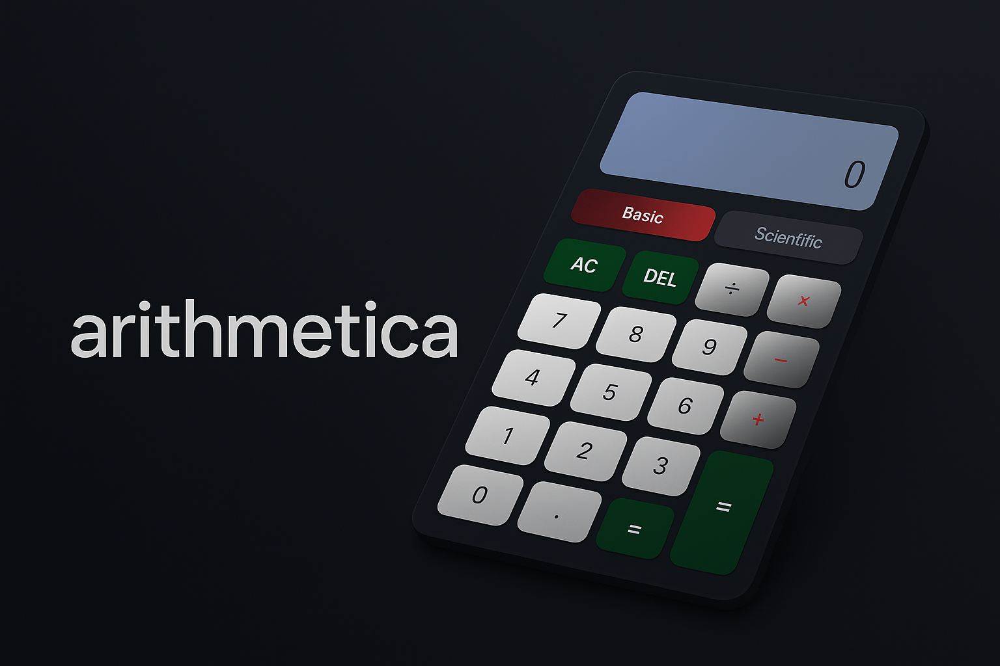

# Modern Scientific Calculator 🧮

A modern and responsive scientific calculator built with **HTML**, **CSS**, and **JavaScript**.  
This project demonstrates clean UI design, modular structure, and basic + scientific calculation features.

---

## 🚀 Features
- Basic arithmetic operations (+, −, ×, ÷)
- Advanced functions (sin, cos, tan, log, exponent, etc.)
- Toggle between **Basic** and **Scientific** modes
- Responsive design for desktop & mobile
- Keyboard input support

---

## 📂 Project Structure

---

## 🖼 Preview


---

## ⚡ Usage
1. Clone the repository:
   ```bash
   git clone https://github.com/Nandinibajaj28/Modern-Scientific-Calculator.git
