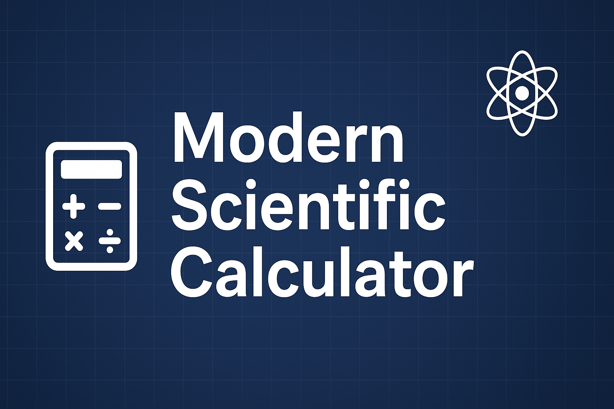

<h1 align="center">Arithmetica</h1>

A simple calculator for your complex maths.

    

  
  
  

  

---

<h3 align="center">👀 <a href="https://airthmetica-calculator.vercel.app/">See it in Action</a> »</h3>

---

[Introduction](#introduction) · [Features](#features) · [Tech Stack](#tech-stack) 

---

## ❄️ Introduction
**My Calculator** is a simple, user-friendly calculator designed to tackle complex math with ease.  
Explore the codebase to discover more.

    

---

## 🚀 Features
- Basic arithmetic operations (+, −, ×, ÷)
- Advanced functions (sin, cos, tan, log, exponent, etc.)
- Toggle between **Basic** and **Scientific** modes
- Responsive design for desktop & mobile
- Keyboard input support

---

## 🛠 Tech Stack
- [HTML5](https://developer.mozilla.org/en-US/docs/Web/HTML) – structuring  
- [CSS3](https://developer.mozilla.org/en-US/docs/Web/CSS) – styling  
- [JavaScript](https://developer.mozilla.org/en-US/docs/Web/JavaScript) – functionality  
- [Git](https://git-scm.com/) – version control   
- [Vercel](https://vercel.com/) – deployment

## 📄 License
This project is licensed under the [GPL-3.0 License](LICENSE).

